## general

This section/folder covers general topics.

+ markdown
  + [syntax][mdSyntax]
  + [pandoc](#pandoc) flexible format converter 
    read and write (md, html, odt, docx, tex, pdf, ...) 
    [github][pandoc_github], [wiki][pandoc_wiki], [tricks][pandoc_tricks]
+ mermaid, explain code without visio
  + [mermaid][mermaid]
    + [flowchart](https://mermaidjs.github.io/flowchart.html)
    + [live editor src](https://github.com/mermaidjs/mermaid-live-editor)
+ emoji
  + [howto](./emoji.md)
  + [emoji cheat sheet](https://www.webpagefx.com/tools/emoji-cheat-sheet/)
+ SW360 [GitHub][gitHubSW360] , [wiki][wikiSW360]
+ [git](./git.md)
+ [graphviz](./graphviz.md), create diagram by code
+ [colors](.ColorImages.md) [wheel](ColorWheel.pdf)
  + [picker](https://www.w3schools.com/colors/colors_picker.asp)

[gitHubSW360]: https://github.com/eclipse/sw360
[wikiSW360]: https://github.com/eclipse/sw360/wiki

### pandoc

[pandoc](https://pandoc.org/index.html) is a flexible document converter.
see [manual](https://pandoc.org/MANUAL.html)  
It can read and write:

+ markdown
+ html
+ odt
+ docx
+ tex
+ pdf
+ epub
+ and more

[example](pandoc_tut.md)

more on github

+ [src][pandoc_github]
+ [wiki][pandoc_wiki]
+ [tricks][pandoc_tricks]

[csc]: https://code.siemens.com/
[cscHlp]: https://code.siemens.com/help
[cscWROhowto]: https://code.siemens.com/walter.obweger/wro-h-howto
[mdSyntax]: https://sourceforge.net/p/scintilla/wiki/markdown_syntax/
[pandoc_github]: https://github.com/jgm/pandoc
[pandoc_wiki]: https://github.com/jgm/pandoc/wiki
[pandoc_tricks]: https://github.com/jgm/pandoc/wiki/Pandoc-Tricks
[msvscDoc]: https://code.visualstudio.com/docs?start=true
[msvscSCM]: https://code.visualstudio.com/docs/editor/versioncontrol

### vscode

Microsoft Visual Studio Code is open source and does not require installation.

+ [home](https://code.visualstudio.com/)
+ [environment](vscode_env.md)
+ [extensions](vscode_ext.md)
+ [marketplace](https://marketplace.visualstudio.com/)

### LaTex

[TUG][latexTUG] distribution list

**install**

```shell
yum whatprovides latex
```

```
exlive-latex-7:20180414-14.el8.noarch : A TeX macro package that defines LaTeX
Repo        : AppStream
Matched from:
Filename    : /usr/bin/latex
```

```shell
yum install texlive-latex
```

```shell
CentOS-8 - AppStream                            1.3 kB/s | 4.3 kB     00:03    
CentOS-8 - Base                                  16 kB/s | 3.9 kB     00:00    
CentOS-8 - Extras                               6.4 kB/s | 1.5 kB     00:00    
Extra Packages for Enterprise Linux Modular 8 -  22 kB/s |  22 kB     00:01    
Extra Packages for Enterprise Linux Modular 8 - 131 kB/s | 154 kB     00:01    
Extra Packages for Enterprise Linux 8 - x86_64   26 kB/s |  22 kB     00:00    
Extra Packages for Enterprise Linux 8 - x86_64  1.7 MB/s | 7.1 MB     00:04    
Dependencies resolved.
================================================================================
 Package                   Arch      Version                 Repository    Size
================================================================================
Installing:
 texlive-latex             noarch    7:20180414-14.el8       AppStream     13 M
Installing dependencies:
 perl-Text-Unidecode       noarch    1.30-5.el8              AppStream    149 k
 perl-XML-XPath            noarch    1.42-3.el8              AppStream     88 k
 texlive-algorithms        noarch    7:20180414-14.el8       AppStream    316 k


 texlive-xunicode          noarch    7:20180414-14.el8       AppStream     51 k
 texlive-zapfding          noarch    7:20180414-14.el8       AppStream     72 k
 zziplib                   x86_64    0.13.68-8.el8           AppStream     91 k

Transaction Summary
================================================================================
Install  104 Packages

Total download size: 143 M
Installed size: 245 M
Is this ok [y/N]: y
Downloading Packages:
(1/104): perl-XML-XPath-1.42-3.el8.noarch.rpm   354 kB/s |  88 kB     00:00    
(2/104): perl-Text-Unidecode-1.30-5.el8.noarch. 506 kB/s | 149 kB     00:00    
```

[latexTUG]: http://www.tug.org/interest.html#free

### git

+ [how-to](./git.md)
+ [about](https://git-scm.com/about)
+ [branch nutshell][gitBranch]
+ [mermaid graph](https://mermaidjs.github.io/)

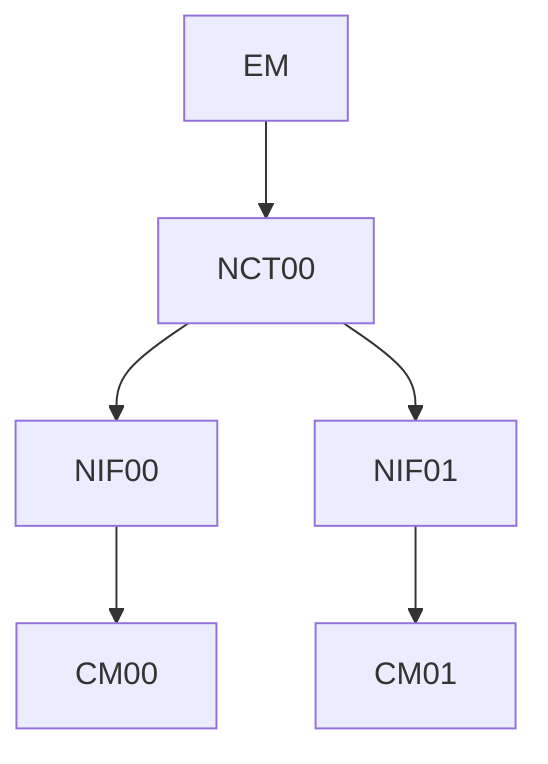


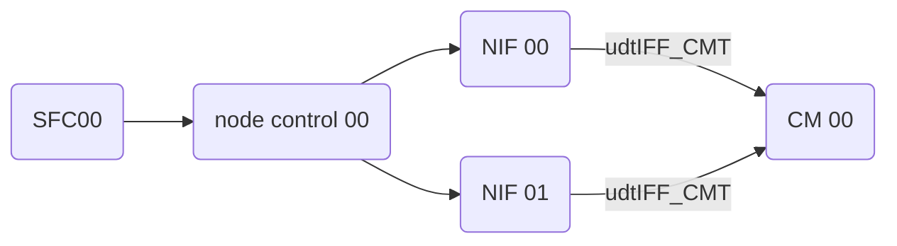

### git local

| step  | comment |
| ----: | ---- |
|       | 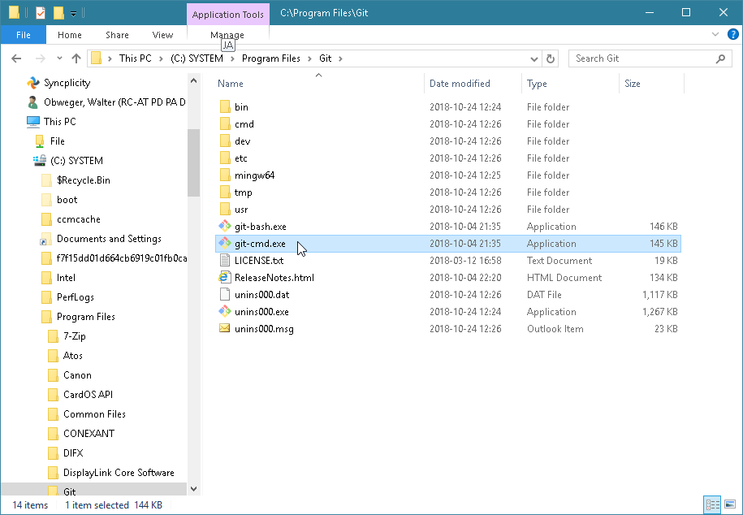
|       | install [git scm](https://git-scm.com/)
|       | use **git-bash** for linux shell (bash)
|       | use **git-cmd** for window shell
|       | 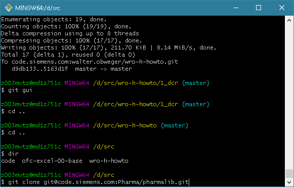
|       | clone repository locally using **bash**
|       | 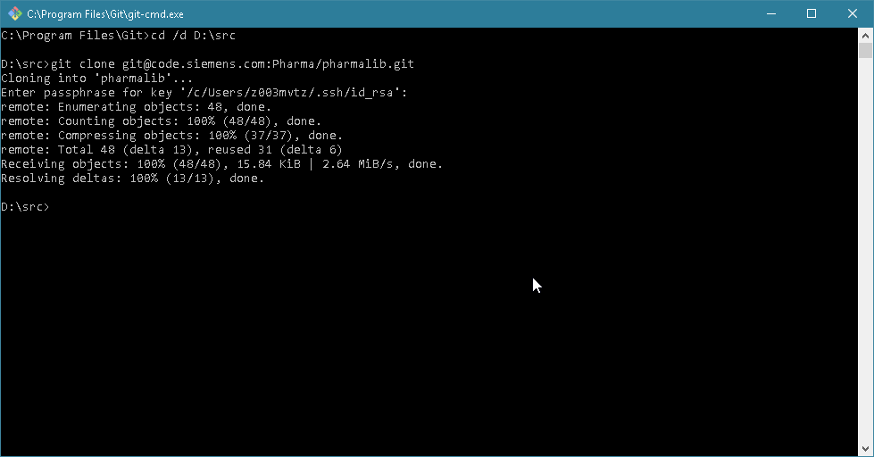
|       | clone repository locally using **cmd**
|       | enter your password, **__note:__** ssh public key has to be registered on c.s.c in advance
|       | wait until done
|       | 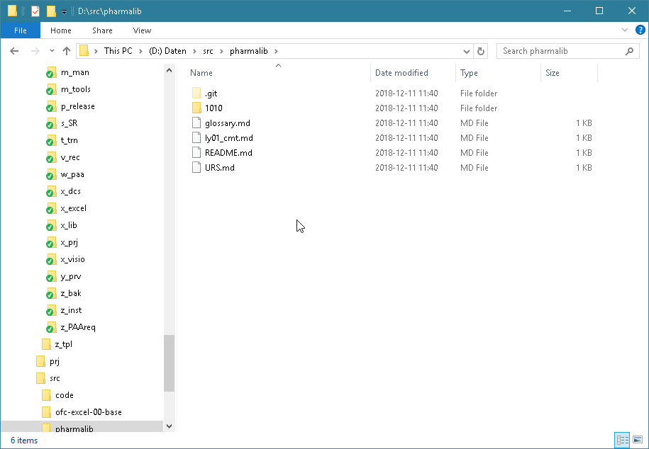
|       | use file explorer to verify
|       | 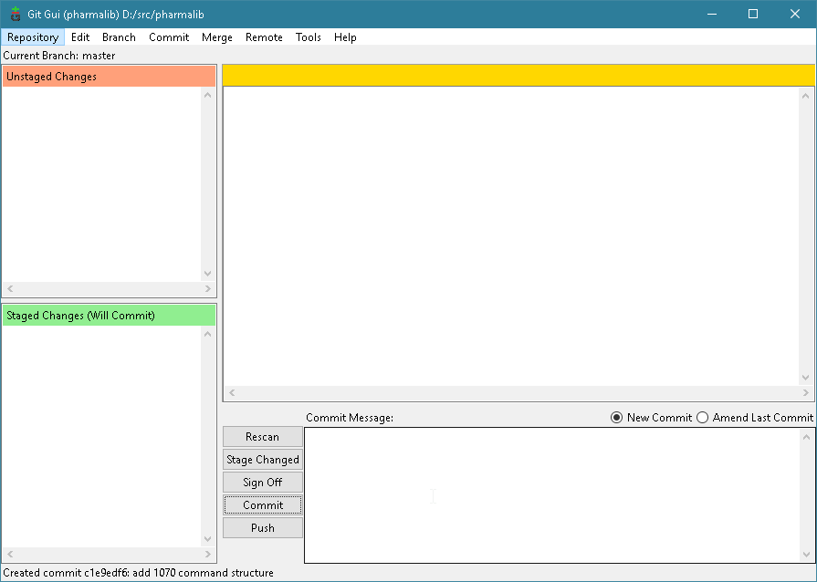
|       | consider using ```git gui``` 
|       | _Stage Changed_
|       | _Commit_
|       | _Push_
|       | 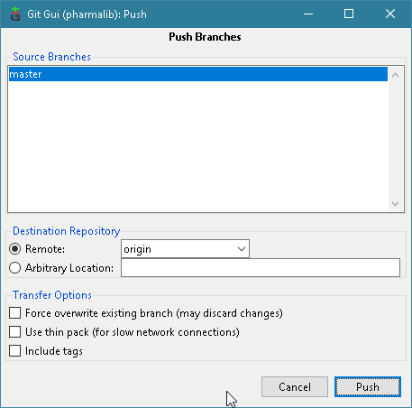
|       | select branch and push
|       | 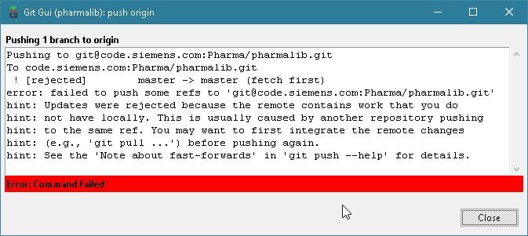
|       | in case you are not uptodate pull first
|       | exit ```git gui```
|       | 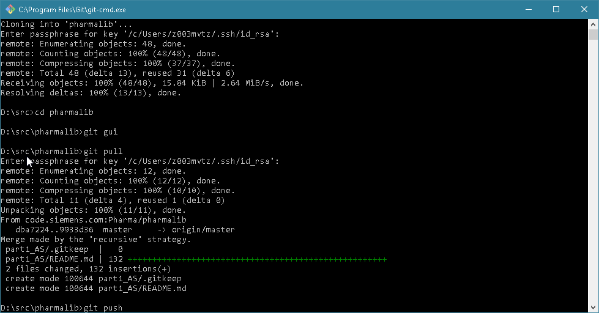
|       | 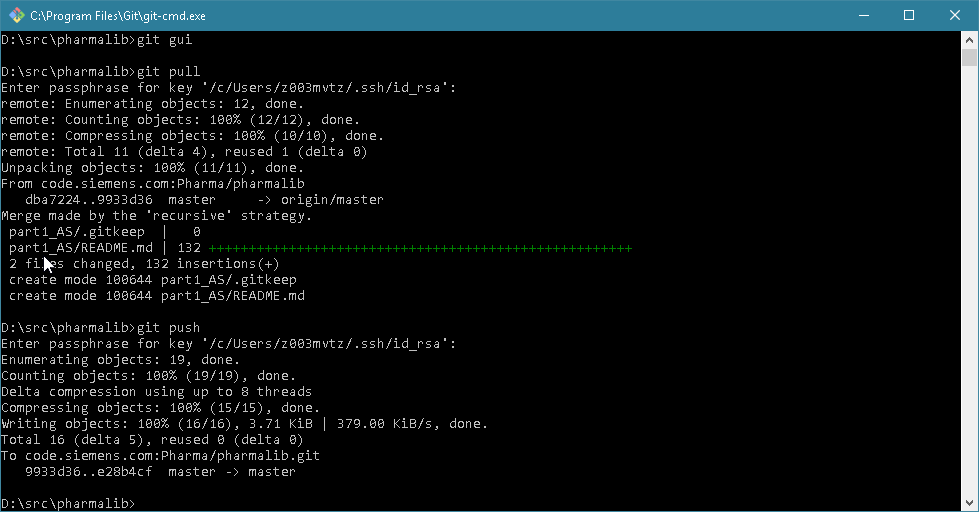
|       | ```git pull``` to merge changes into your local data
|       | ```git push``` after having resolved problems
|       | 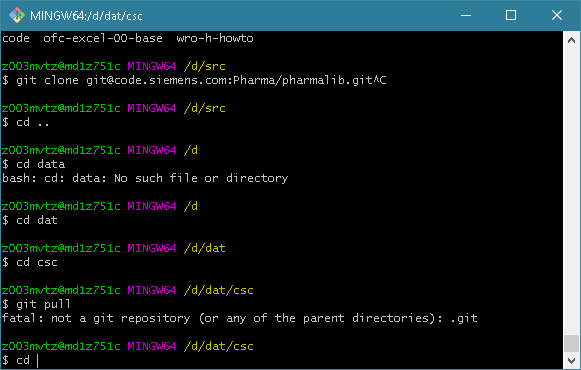
|       | folder **.git** has to be found in parent 

### git local vscode

Microsoft offers a open source Visual Studio Code

```
Version: 1.27.2 (system setup)
Commit: f46c4c469d6e6d8c46f268d1553c5dc4b475840f
Date: 2018-09-12T16:17:45.060Z
Electron: 2.0.7
Chrome: 61.0.3163.100
Node.js: 8.9.3
V8: 6.1.534.41
Architecture: x64
```

| step  | comment |
| ----: | ----|
|       | 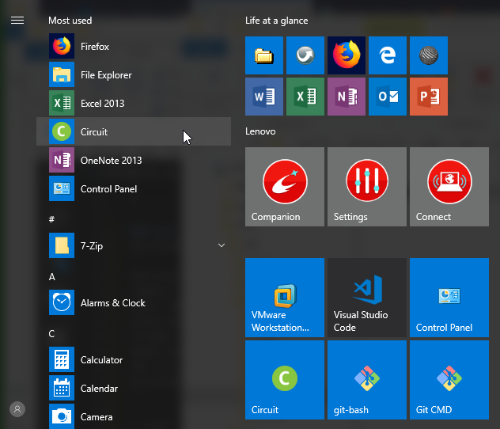
|       | |
|       | 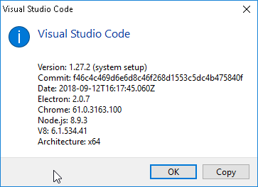
|       | |
|       | 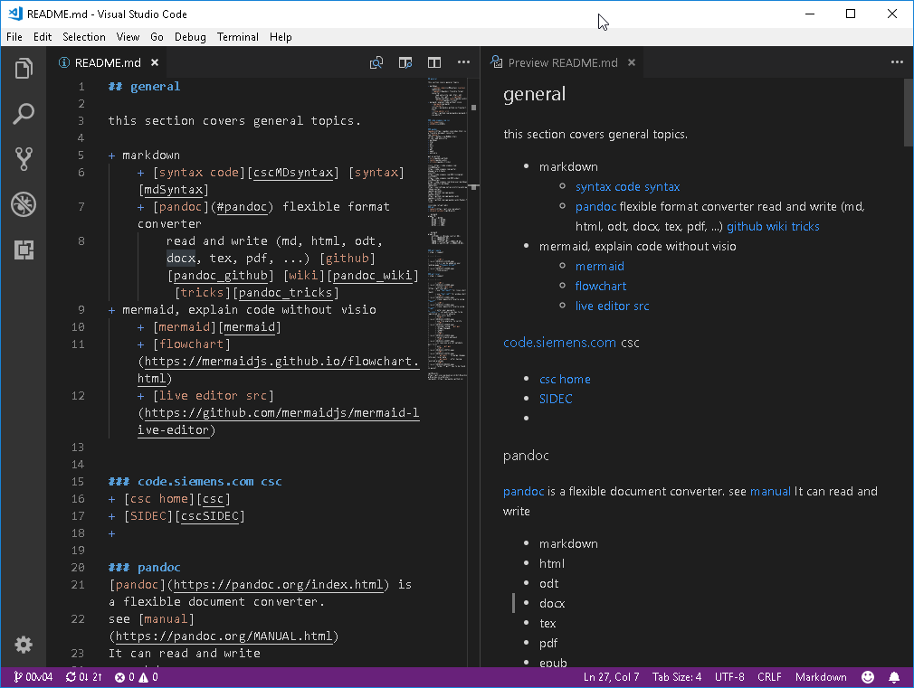
|       | install [MS Visual Studio Code](https://code.visualstudio.com/)
|       | 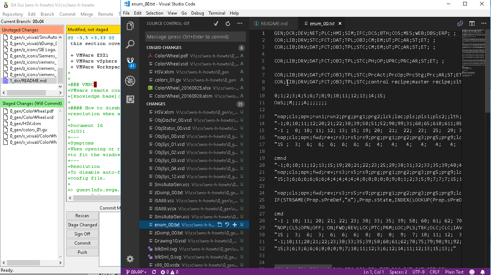
|       | msvsc is able to stage changes, commit and much more in a convenient way
|       | 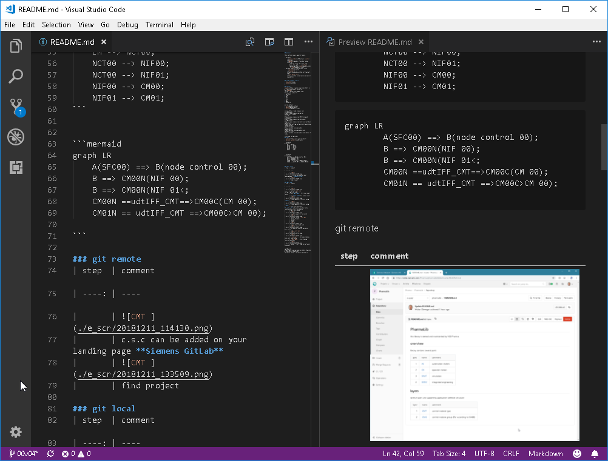
|       | review window is able to render markdown files
|       | 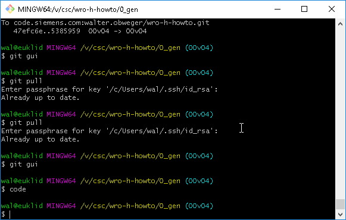
|       | launch `"C:\Program Files\Microsoft VS Code\Code.exe"` from git-scm shell (CMD or BASH) to inherit ssh settings
|       | 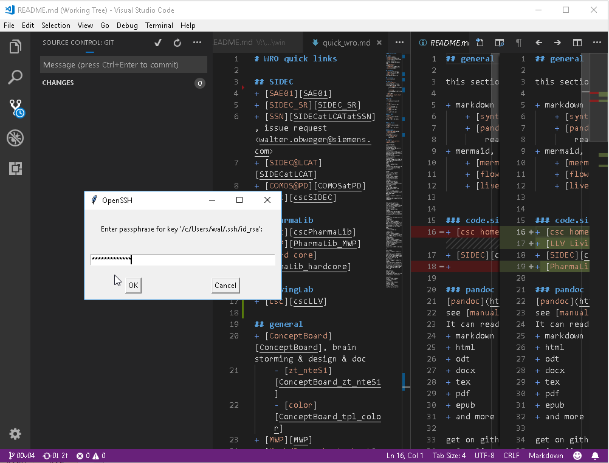
|       | enter phrase ...

[gitBranch]: https://git-scm.com/book/en/v2/Git-Branching-Branches-in-a-Nutshell
[mermaid]: https://mermaidjs.github.io/

### git lfs

+ [getting started](https://about.gitlab.com/blog/2017/01/30/getting-started-with-git-lfs-tutorial/)
+ [handling](https://www.git-tower.com/learn/git/ebook/en/desktop-gui/advanced-topics/git-lfs/?utm_source=gitlab-blog&utm_campaign=GitLab%20LFS&utm_medium=guest-post)

```shell
git lfs track "*.png"
git lfs track "*.pdf"
git lfs track "*.zip"
git lfs track "*.7z"
git lfs track "*.tar"
git lfs track "*.gz"
git lfs track "*.exe"
git lfs track "*.xls"
git lfs track "*.xlsm"
git lfs track "*.xlsx"
git lfs track "*.doc"
git lfs track "*.docx"
git lfs track "*.vsd"
git lfs track "*.vsdx"
git lfs track "*.vss"
git lfs track "*.vssx"
git lfs track "*.ppt"
git lfs track "*.pptx"
git lfs track "largefiles/*.xml"
git lfs track "largefiles/*.csv"
```

commit `.gitattributes`

```shell
git lfs ls-files
```

migration

```shell
git lfs migrate import --include "*.jpg,*.png,*.pdf,largefiles/*.xml" --include-ref=refs/heads/master
```

useful tutorial

+ [atlassian](https://support.atlassian.com/bitbucket-cloud/docs/use-bfg-to-migrate-a-repo-to-git-lfs/)
  + [lfs](https://www.atlassian.com/git/tutorials/git-lfs)
+ [bfg](https://rtyley.github.io/bfg-repo-cleaner/)
+ [gitlab](https://docs.gitlab.com/12.10/ee/topics/git/lfs/migrate_to_git_lfs.html)
+ [git lfs tutorial](https://github.com/git-lfs/git-lfs/wiki/Tutorial#migrating-existing-repository-data-to-lfs)

### migrate existing repos

```shell
git clone --mirror git@<site>:<group>/<repo>.git
cd <repo>.git
git lfs migrate import --everything --include "*.png"
git lfs migrate import --everything --include "*.pdf"
git lfs migrate import --everything --include "*.zip"
git lfs migrate import --everything --include "*.7z"
git lfs migrate import --everything --include "*.tar"
git lfs migrate import --everything --include "*.gz"
git lfs migrate import --everything --include "*.exe"
git lfs migrate import --everything --include "*.ppt"
git lfs migrate import --everything --include "*.pptx"
git lfs migrate import --everything --include "*.vsd"
git lfs migrate import --everything --include "*.vsdx"
git lfs migrate import --everything --include "*.doc"
git lfs migrate import --everything --include "*.docx"
git lfs migrate import --everything --include "*.xlsm"
git lfs migrate import --everything --include "*.xlsx"
git lfs migrate import --everything --include "*.xls"
git lfs migrate import --everything --include "*.vss"
git lfs migrate import --everything --include "*.vssx"
git lfs migrate import --everything --include "largefiles/*.xml"
git lfs migrate import --everything --include "largefiles/*.csv"
git reflog expire --expire-unreachable=now --all
git gc --prune=now
git push --force
```

+ [git lfs tutorial](https://github.com/git-lfs/git-lfs/wiki/Tutorial#migrating-existing-repository-data-to-lfs)

