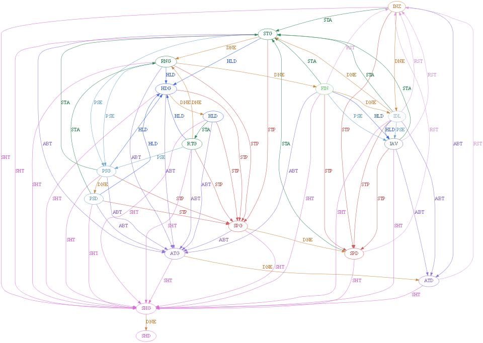
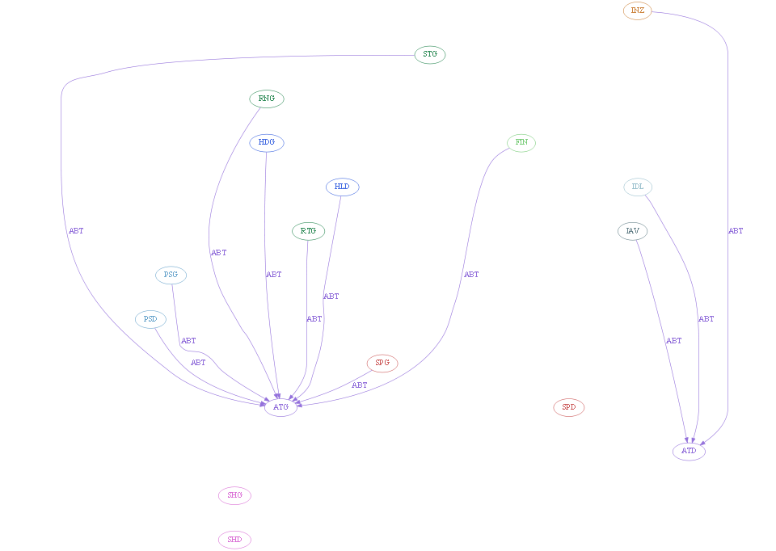
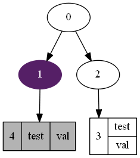
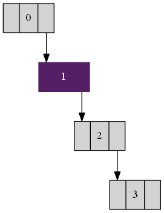
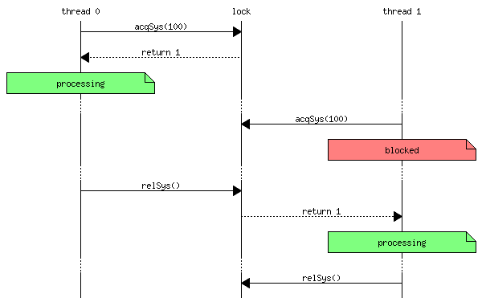
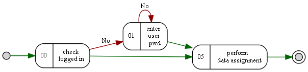

### graphviz 
+ [graphviz](http://graphviz.org/) 
+ [doc](http://graphviz.org/documentation/) 
+ [dot](https://graphviz.gitlab.io/_pages/doc/info/lang.html) 
#### state machine
+ full state machine [src](./x_gv/vcsFlow_00.gv)  
    
+ specific commands active [src](./x_gv/vcsFlow_00_ABT.gv)  
    

#### manual
+ [dot guide](./x_gv/dotguide.pdf), 

#### digraph
[stp00.gv](./x_gv/stp00.gv)
``` 
digraph G {

    s00 [label="0"]
    s01 [label="1",style="filled",color="#551F66",fontcolor="#ffffff"]
    s02 [label="2"]
    s03 [label="<key> 3| {test|val}",shape="record"]
    s04 [label="4| test|val",shape="record",style="filled",fillcolor="gray70"]
    s00 -> s01
    s00 -> s02
    s02 -> s03:<key>
    s01 -> s04
}
```
convert to image
```
dot -Tpng -ostp00.png stp00.gv
```


---
[stp10.gv](./x_gv/stp10.gv)
```
digraph G {
    node [ 
        shape="record",
        style="filled",
    ];

    s00 [label="<lf>|0|<rg>"]
    s01 [label="<lf>|1|<rg>",color="#551F66",fontcolor="#ffffff"]
    s02 [label="<lf>|2|<rg>"]
    s03 [label="<lf>|<key> 3|<rg>"]
    s00:<rg> -> s01:<lf>
    s01:<rg> -> s02:<lf>
    s02:<rg> -> s03:<lf>
}

```
convert to image
```
dot -Tpng -ostp10.png stp10.gv
```


#### message sequence

[stp20.gv](./x_gv/stp20.gv)
```
msc {
    a[label="thread 0"],l[label="lock"],b[label="thread 1"];
    a=>l [label="acqSys(100)"];
    l>>a [label="return 1"];
    a note a [label="processing",textbgcolour="#7fff7f"];
    ...;
    b=>l [label="acqSys(100)"];
    #--- [label="thread 0 perform processing"];
    b note b [label="blocked",textbgcolour="#ff7f7f"];
    ...;
    a=>l [label="relSys()"];
    l>>b [label="return 1"];
    b note b [label="processing",textbgcolour="#7fff7f"];
    ...;
    b=>l [label="relSys()"];
}
```
convert to image
```
mscgen -T png -i stp20.gv
```


#### workflow
```
digraph WrkFlw {
    rankdir=LR;
    minlen=1;
    edge [color="darkgreen",fontsize=10];
    node[fontsize=10,style=rounded];
    sBeg [label="",shape=circle,width=.15,style=filled,fixedsize=true];
    sEnd [label="",shape=doublecircle,width=.15,style=filled];
    {
        node [shape=record];
        s00 [label="{00|check \nlogged in}"];
        s01 [label="{01|enter \n user \n pwd}"];
        s05 [label="{05|perform \n data assignment}"];
    }
    sBeg    ->  s00;
    s00     ->  s05;
    s01     ->  s05;
    s05     ->  sEnd;
    edge [label="No",color="red4",fontsize=10];
    s00     ->  s01;
    s01     ->  s01;
}
```

```
	dot -Tpng -oflow00.png flow00.gv
```


