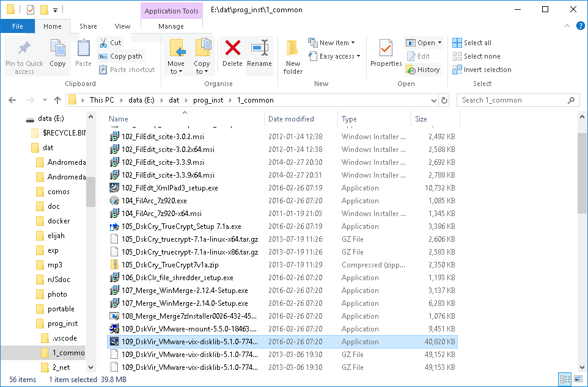

## prog\_inst

this section describes programmers collection of tools mostly free and open source.
however to be sure check licenses to be sure.

### structure

applications are grouped

| group     | comment   |
| ---       | ---       |
|1_common   | elementary appl
|2_net      | basic networking
|3_dbs      | database system tools
|4_py24     | python 24 appl and tools
|4_py25     | python 24 appl and tools
|5_java     | java appl and tools
|5_perl     | perl appl and tools
|6_cpp      | C++ appl and tools
|7_add      | additional appl and tools
|7_prg      | programming tools
|8_doc      | documentation tools
|8_misc     | miscellaneous tools
|8_web      | web tools
|9_cfg      | configuration 
|D_drv      | driver 
|E_release  | release 
|P_portable | portable 
|R_apps     | restricted apps, licensed 
|X_vidarc   | VIDARC appl 
|Z_SysTools | system tools 

to ensure proper installation order 3 digit number is added to original filename.

|step | comment|
|---: | --- |
|   |
|   |1_common group
