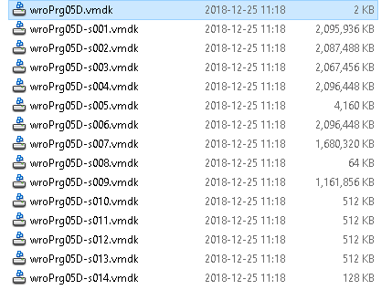
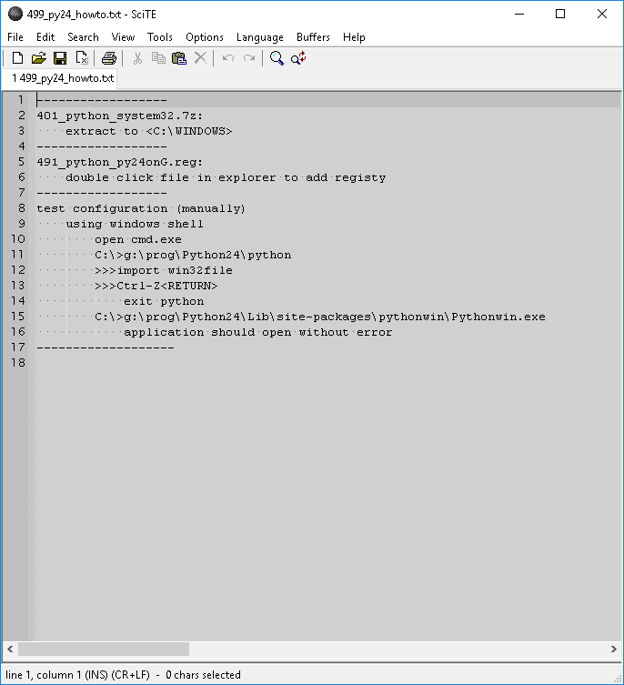

## wroPrg05D.vmdk
this section describes features combined into virtual disk 
wroPrg05D.vmdk

|step | comment|
|---: | --- |
|   |
|   |virtual disk
|   |
|   |configure environment by starting exc.bat and pass arguments
|   | `G:/data/env/exc.bat py24C win 2_py24C`, setup python 24 32bit for windows and set title to 2_py24C and some more
|   |
|   |
|   |notice development toolchain has been configured, all is located at drive G
|   |therefore implementing portable development toolchain only minor registry entries are required and some dll have to be placed in system folders [setup](#setup)

### hints
use *_VMWare Virtual Disk Development Kit_* to mount *_vmdk_* on your
host (`109_DskVir_VMware-vix-disklib-5.1.0-774844.i386.exe` part of 
[prog_inst](./prog_inst.md)).

on virutal machine just add vmdk as disk and configure guest system accordingly.

### setup
python require some registry enties and libraries placed into system folders.

|step | comment|
|---: | --- |
|   |
|   |
|   |
|   |`x99_y_howto.txt` provide old fashion instructions
