## windows

basic windows configuration

### win10

+ remove library entries in file explorer, reg files for 
    [32bit](./cfg/win10/32-bit_Remove_All_user_Folders_in_This_PC-RECOMMENDED.reg)
    [64bit](./cfg/win10/64-bit_Remove_All_user_Folders_in_This_PC-RECOMMENDED.reg)
+ disable memory compression exec in Powershell `Disable-MMAgent -mc`
  with administrator rights

### memory compression

at some point memory compression has been sneaked in.
win10 exceed regular system resource by far,
16GB RAM or more are required.
this on-the-fly memory compression lead to high CPU
utilization on my Lenovo C940, it has enough RAM, therefore
this feature is not required.

| step  | comment   |
| ---   | ---       |
|       | 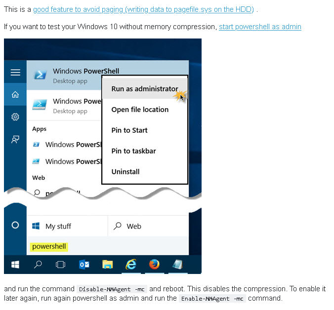
|       |
|       | 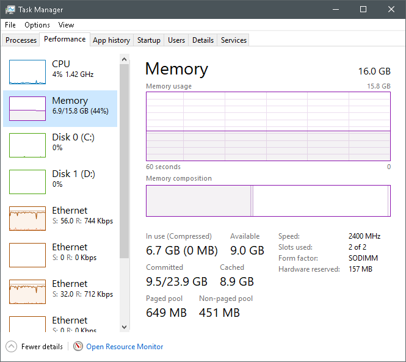
|       |

### shadow copies

#### How to Delete All VSS Shadows and Orphaned S...

http://backupchain.com/i/how-to-delete-all-vss-sh...

Deleting orphaned Volume Shadow Copy Service (VSS) shadows may be necessary from time to time
for several reasons.

+ You are using defect backup software or some scripts that don't clean up correctly. In that case
follow instructions below and switch to BackupChain®.
+ Your backup software crashes all the time. Ultimately, you would want to switch to BackupChain
for sure
+ System Restore keeps filling up your drive with shadows. Some people argue, it's Microsoft's bad
design; we agree.
+ Shadows may have been created by another operating system instance in a multi-boot
environment
+ a lot more causes are possible…

 The Result / Effect VSS Shadows have:  
A slow PC or Server, or worse, the system becomes instable and unresponsive. In most cases you
wasted a lot of time and most of the time, you can thank Microsoft for it!
There are several ways the Windows system may get clogged with orphaned shadows and
unfortunately the system won't start deleting until you have a whopping 64 of them!
Below are the clean-up instructions.
Note: Each version of Windows is a little different and the command parameters may vary:
Note #2: Some backup applications may be relying on these shadows. It's not the finest software
Home Features Download Support Helpline

design to do it that way.
By the way, BackupChain certainly does not clog your system and is designed to clean up each
shadow immediately

> open command shell as Administrator and execute

```shell
vssadmin delete shadows /all
```

to delete even more

```shell
vssadmin Resize ShadowStorage /For=C: /On=C: /MaxSize=300MB
```

on windows server's do run

```shell
vssuirun.exe
```

Now go through each drive and:

+ delete each shadow
+ disable the schedule (this won't disable shadows; it's impossible to disable shadows)
+ go to the settings of each drive and use "No Limit" for best performance
+ ensure you have at least 50GB free on each disk and at least 10% whichever is higher.

### disable Win10 update

| step  | comment   |
| ---   | ---       |
|       | 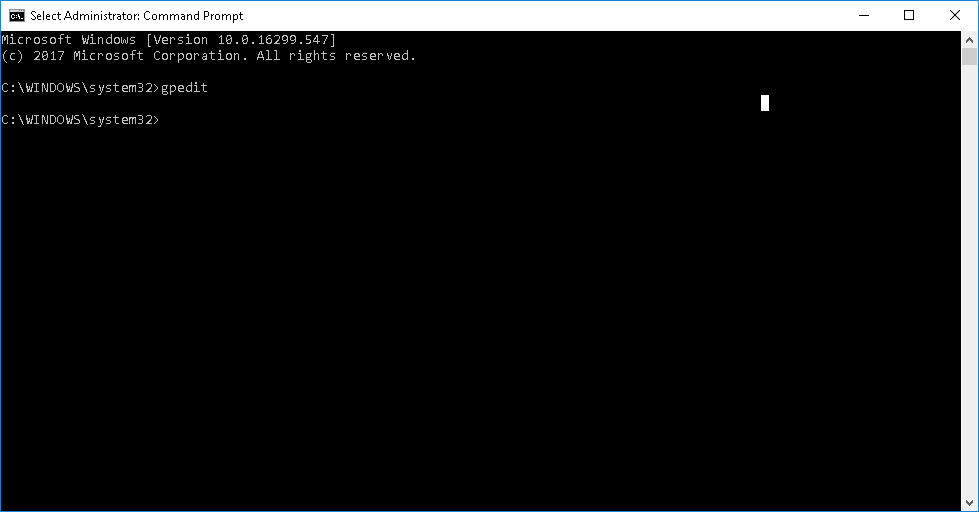
|       |
|       | 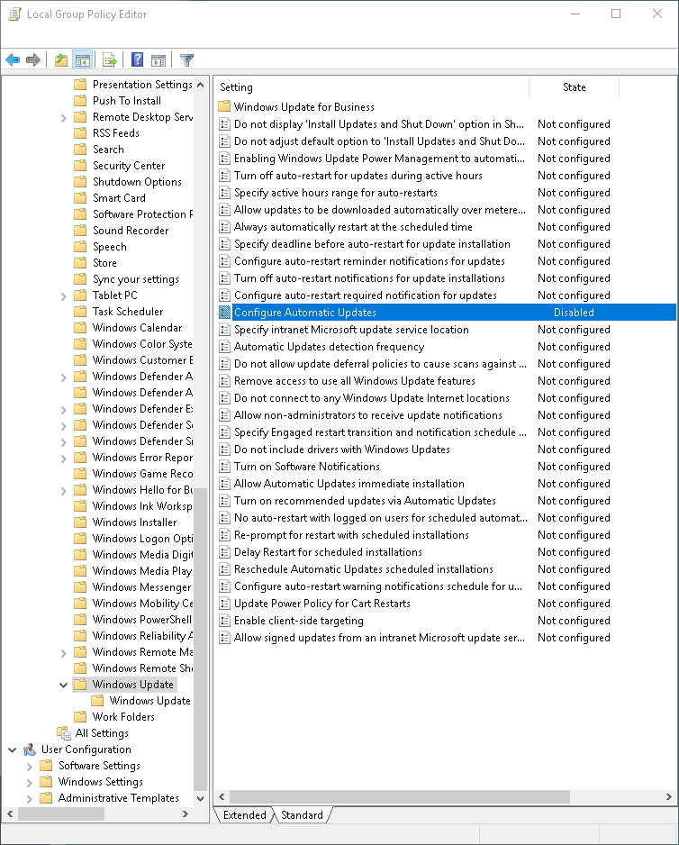
|       |
|       | 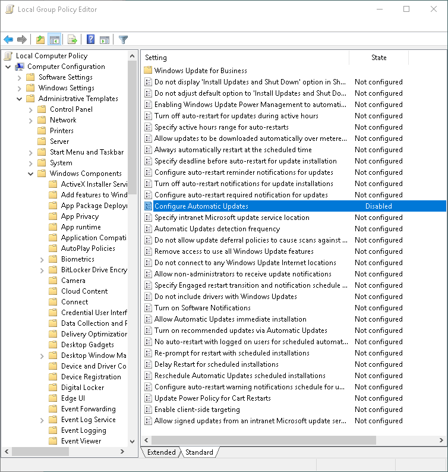
|       |
|       | 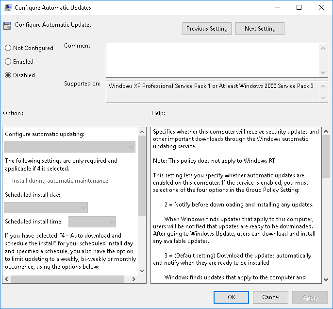
|       |
|       | 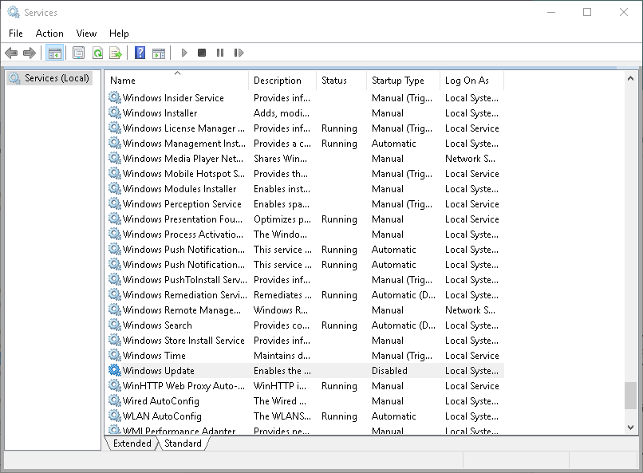
|       |
|       | 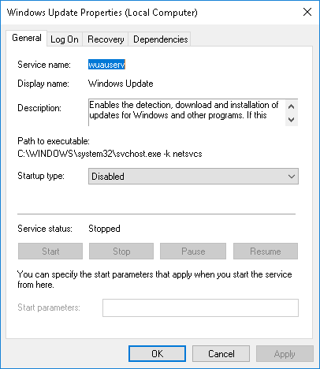
|       |
|       | 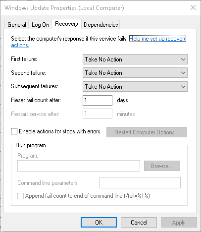
|       |

### disable update orchestrator

Win10 want to reboot your machine, when it's most inconvenient, consider
disabling update orchestration to stay in control.

| step  | comment   |
| ---   | ---       |
|       | 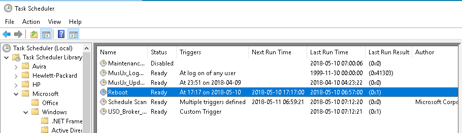
|       |
|       | 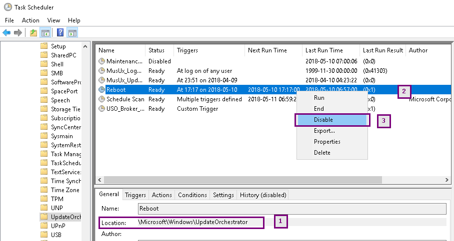
|       |

### windows defender

on PCS7 Windows Defender causes some times heavy CPU load 
| step  | comment   |
| ---   | ---       |
|       | 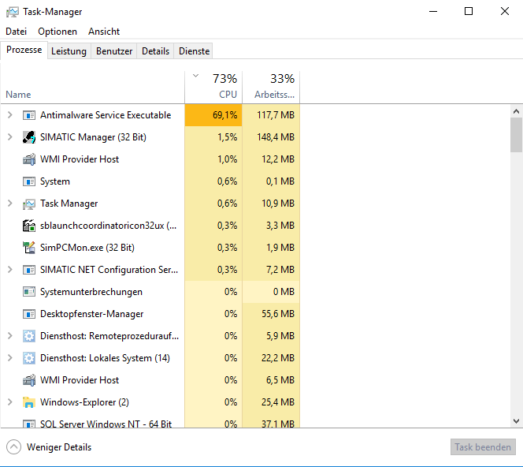
|       |
|       | 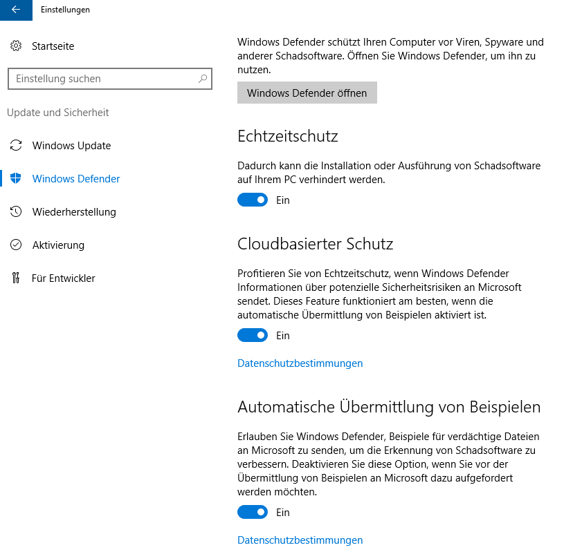
|       |
|       | 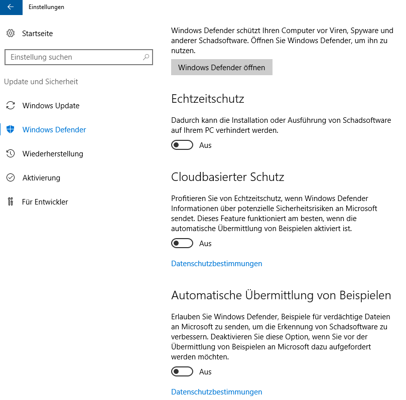
|       |
