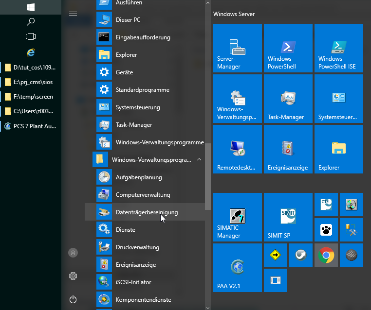
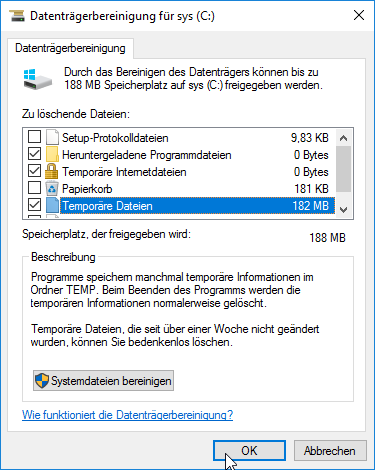
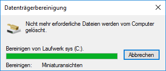
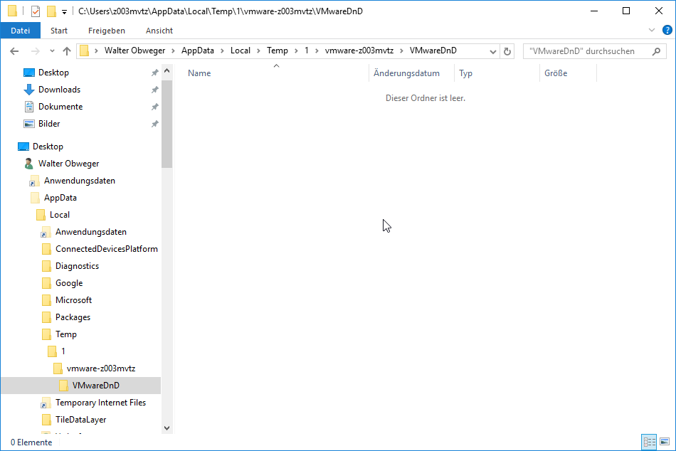

## Windows Server 2016 de

| step  | comment       |
| ----: | ----          |
|       | 
|       | goto Windows-Verwaltungsprogramme->Datentraegerbereinigung
|       | 
|       | 
|       | select temporaere Dateien
|       | click OK
|       | 
|       | 
|       | check result
