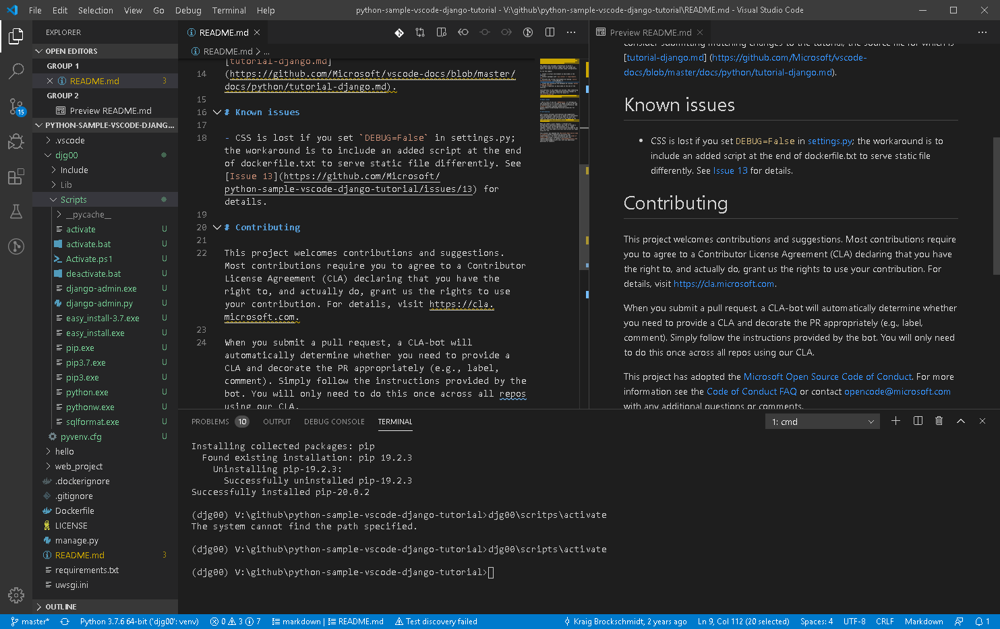
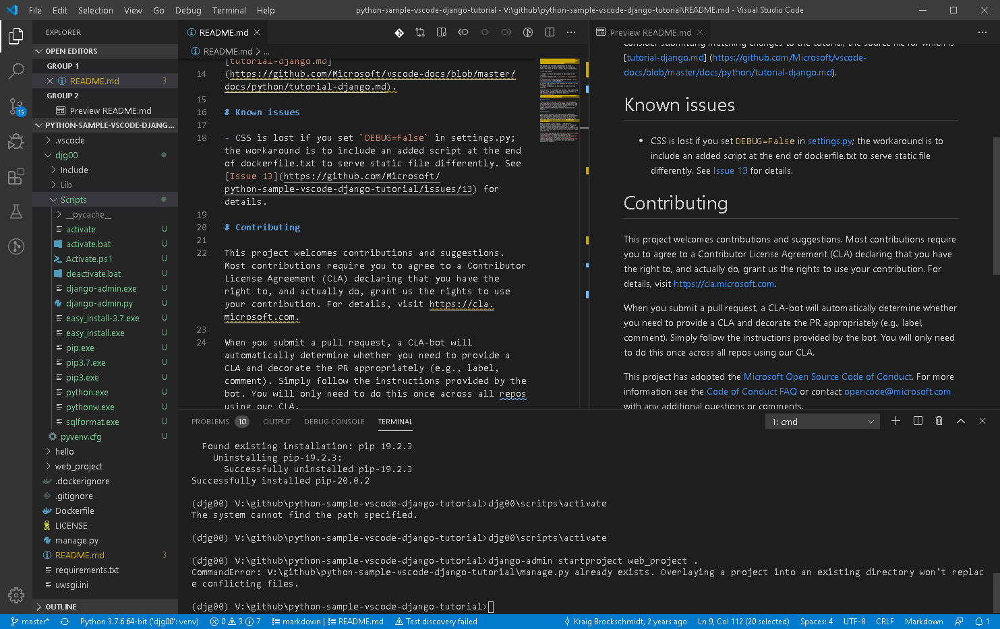
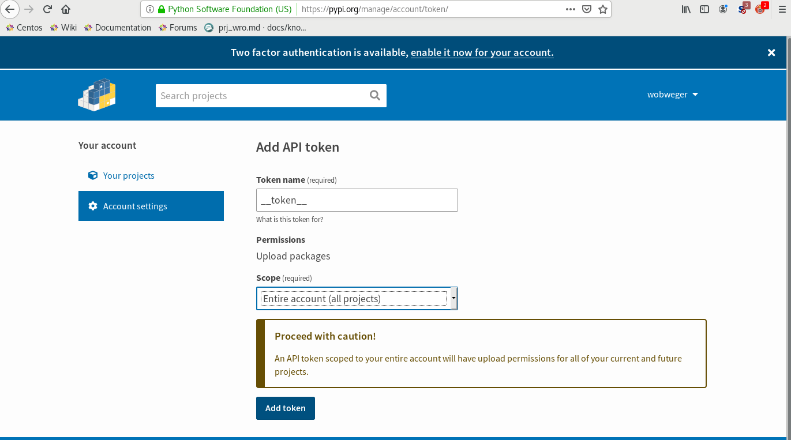

## python

+ [anaconda](https://www.anaconda.com/distribution/), extensive data science related distribution
+ [jupyter](./jupyter.md)
  + vscode extension [VS Code Jupyter Notebook Previewer](https://marketplace.visualstudio.com/items?itemName=jithurjacob.nbpreviewer) :+1:
+ [vscode env](https://code.visualstudio.com/docs/python/environments)
+ [pandas](https://pandas.pydata.org/pandas-docs/stable/)
  + [api](https://pandas.pydata.org/pandas-docs/stable/reference/index.html#api)
+ [wx](https://wxpython.org/)
  + [api](https://docs.wxpython.org/)
+ [py2 to py3](#py2py3)

### books

recommended books are referenced here.  
please consider supporting author(s) by a purchase.

|nr  |comment|
|--- |--- |
|:one:|
|    |Dan Bader wrote a very good book, it's practical introduction to python3.
| paper | ISBN: 9781775093329 |
| eBook| ISBN: 9781775093336 |
| | [realpython.com/pybasicmags-book](https://realpython.com/pybasics-book)
|    |
|    |Dan Bader wrote a very good book, it's a deeper dive into python.
|   |:bulb: not novice
| paper | ISBN: 9781775093305 |
| eBook| ISBN: 9781775093312 |
| | [realpython.com/pytricks-book](https://realpython.com/pytricks-book)

### link

+ pandas
  + [format](https://stackoverflow.com/questions/45985358/how-to-wrap-text-for-an-entire-column-using-pandas)
  + [format writer](https://pbpython.com/improve-pandas-excel-output.html)
  + [DatSciHandBook](https://github.com/jakevdp/PythonDataScienceHandbook)

### py2 to py3{#py2py3}

unfortunately there are inconsistencies between python2 and python3

package six provide help [man](https://six.readthedocs.io/).

+ [xrange](#py2py3xrange): for loops

#### xrange{#py2py3xrange}

```python
for i in xrange(1,10):
  print i
```

```python
import six

for i in six.moves.xrange(1,10):
  print(i)
```

### tutorial

+ how to, located in repo
  + [base](stpPy01_base.ipynb)
  + [regex](stpPy02_regex.ipynb) , [regEx00](regEx00.ipynb)
  + [time](stpPy03_time.ipynb)
  + [WebScrap](WebScrap.ipynb)
  + [time](WebScrapBeautifulSoup.ipynb)

### packaging

+ [tutorial](https://packaging.python.org/tutorials/packaging-projects/#classifiers)
+ [installing](https://packaging.python.org/tutorials/installing-packages/)
+ [classifiers](https://pypi.org/classifiers/)

### installer

```shell
pip install PySimpleGUI
pip install PyInstaller
```

run on our script **my_program.py**

```shell
pyinstaller -wF my_program.py
```

### wxPython

+ [Getting started](https://wiki.wxpython.org/Getting%20Started)
+ [boa](https://sourceforge.net/projects/boa-constructor/)

+ [pySimpleGUI](https://pysimplegui.readthedocs.io/en/latest/)
+ [pySimpleGUI git](https://github.com/PySimpleGUI/PySimpleGUI)

#### install{#wxPython_install}

type in anaconda prompt

```shell
conda install -c anaconda wxPython
```

to install optional package wxPython

builder

+ wxGlade
+ boa-constructor (obsolete)


```shell
pip install pysimplegui
```

## tesseract OCR

HP/Google released OCR under `Apache 2.0 license`

+ [tesseract](https://github.com/tesseract-ocr/tesseract)
+ [UB Mannheim](https://github.com/UB-Mannheim/tesseract/wiki)
  also tesserAct need be installed
+ [pypi](https://pypi.org/project/pytesseract/)

```shell
pip install pytesseract
pip install tesseract
pip install opencv-python
```

python 3.8 may need additional opencv package

```shell
pip install opencv-contrib-python
```

## opencv

```shell
pip install opencv-python
pip install opencv-contrib-python
```

### django

django is a web-UI for python code.

#### vscode django tutorial

|nr  |comment|
|--- |--- |
|    | |
|    |  |
|    | |
|    |  |
|    | |
|    |  |
|    | |
|    |  |
|    | |
|    |  |
|    | |
|    |  |
|    | |
|    |  |
|    | |
|    |  |
|    | |
|    |  |
|    | |
|    |  |
|    | |
|    |  |
|    | |
|    |  |
|    | |
|    |  |
|    | |
|    |  |
|    | |
|    |  |
|    | |
|    |  |
|    | |
|    |  |
|    | |
|    |  |
|    | |
|    |  |
|    | |
|    |  |
|    | |
|    |  |
|    | |
|    |  |
|    | |
|    |  |
|    | |
|    |  |
|    | |
|    |  |
|    | |
|    |  |

### pypi

python package index

+ [pypi](https://pypi.org)
  + [verified eMail](https://test.pypi.org/help/#verified-email)
  + [howto](https://packaging.python.org/tutorials/packaging-projects/)
+ [test pypi](https://test.pypi.org/)
+ [API token](https://test.pypi.org/help/#apitoken)


additional tools

+ [FreeOTP](https://freeotp.github.io/)
  open source 2FA
+ [twine](https://packaging.python.org/key_projects/#twine)
  upload to pypi
  + [github](https://github.com/pypa/twine)


example on lindworm

+ build 
+ [tst](https://test.pypi.org/project/lindworm/)
+ [prd](https://pypi.org/project/lindworm/)

[tst.pypi]: https://test.pypi.org/
[prd.pypi]: https://pypi.org/

| step | description |
| ---: | --- |
|    1 | `python3 setup.py sdist bdist_wheel`
|    2 | login to [tst.pypi][tst.pypi] |
|    3 | add token at [account settings](https://pypi.org/manage/account/) |
|      | 
|    4 | enter token name '__token__'
|      | 
|    5 | copy token |
|      | 
|    6 | create file `.pypirc` in workspace folder|
|      | 
|    7 | paste token in |
|      | |
|    7 | upload now to test , `twine upload --repository-url https://test.pypi.org/legacy/ dist/*`
|      | |
|    8 | check [result](https://test.pypi.org/project/lindworm/)
|      | check `pip install --index-url https://test.pypi.org/simple/ lindowrm`|

[prd.pypi]: https://pypi.org/

| step | description |
| ---: | --- |
|    1 | `python3 setup.py sdist bdist_wheel`
|    2 | login to [prd.pypi][prd.pypi] |
|    3 | add token at [account settings](https://pypi.org/manage/account/) |
|      | |
|    4 | enter token name '__token__'|
|      | |
|    5 | copy token |
|      | |
|    6 | create file `.pypirc` in workspace folder |
|      | |
|    7 | upload now to test , `twine upload dist/*` |

source distribution and wheel are generated

```shell
twine upload dist/*
```

combine `.pypirc`

```
[distutils]
index-servers=
    pypi
    testpypi

[testpypi]
repository: https://test.pypi.org/legacy/
username: your testpypi username
```

links

+ [twine github](https://github.com/pypa/twine)
+ [dist packages](https://packaging.python.org/guides/distributing-packages-using-setuptools/)
+ [tst pypi guide](https://packaging.python.org/guides/using-testpypi/)
+ [keyring](https://pypi.org/project/keyring/)

### prerequisite steps

python prepare on linux (CentOS)

as su

```shell
pip3 install twine
```

```shell
python3 -m ensurepip --default-pip
```

```shell
python3 -m pip install --upgrade pip
```
