### OpenRefine

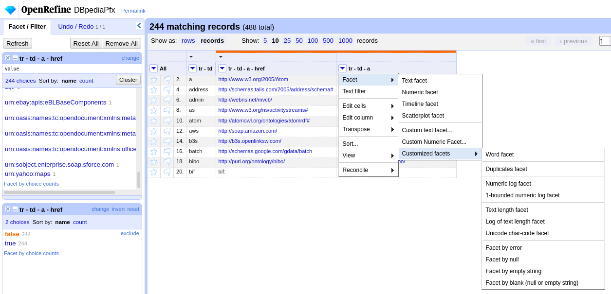
customized facet

#### fetch page and extract all links
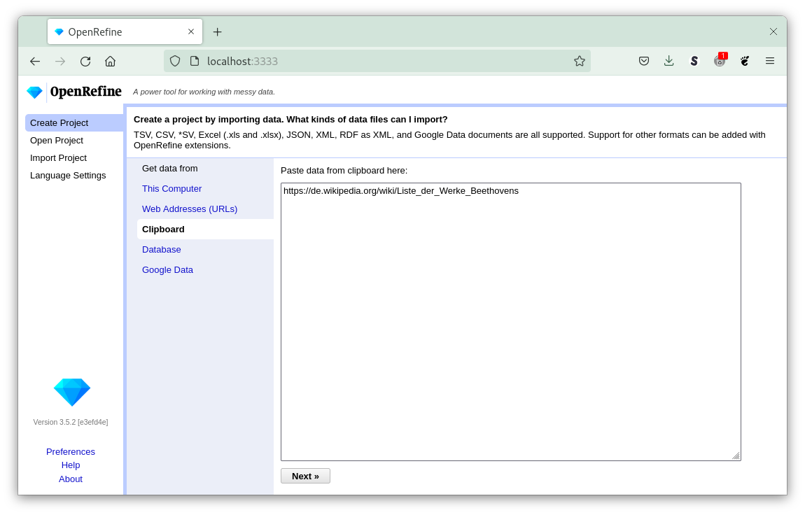
create project from clipboard
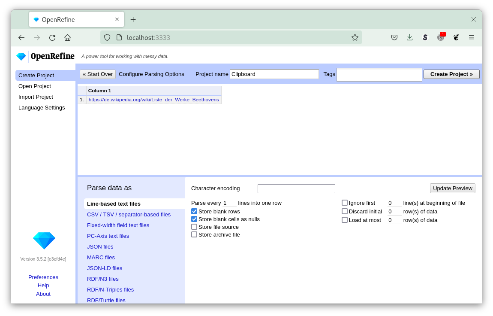
create project
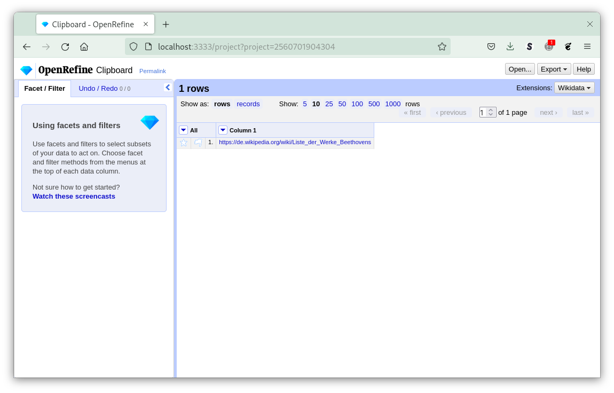
url to process
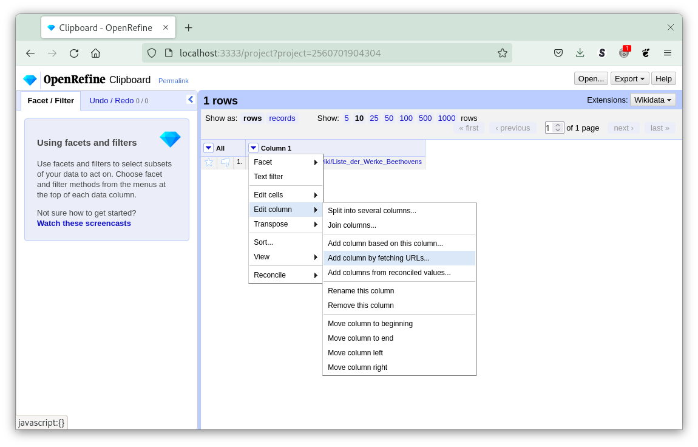
fetch url
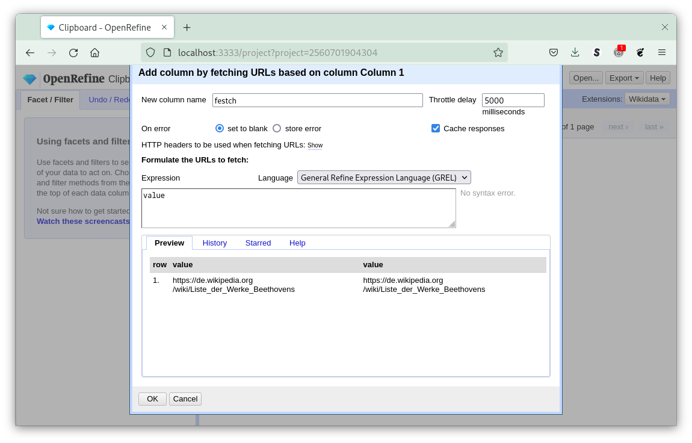
fetch page from site
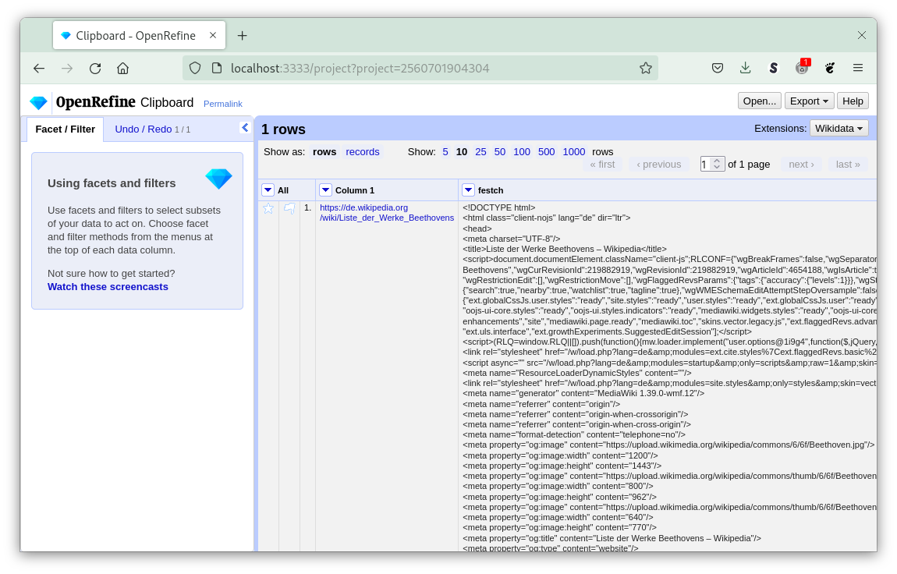
retrieved page
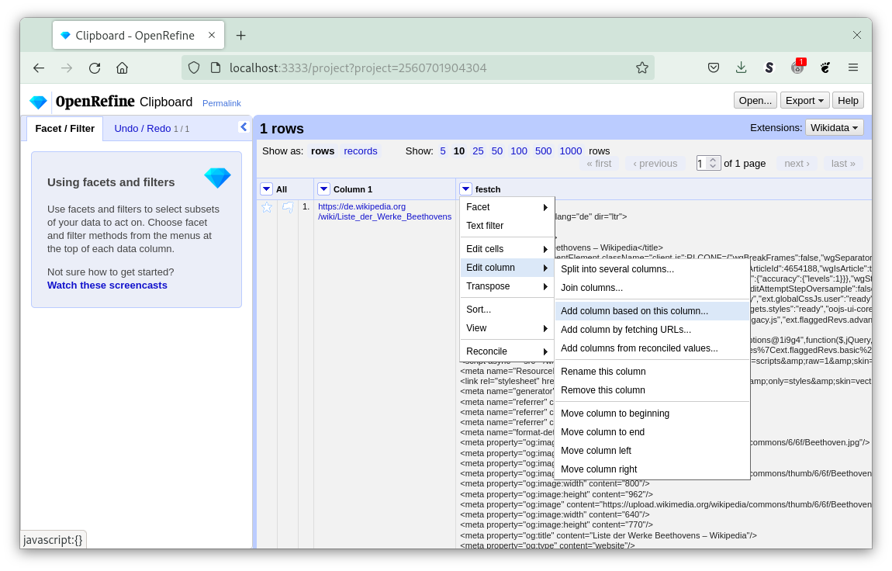
transform page received
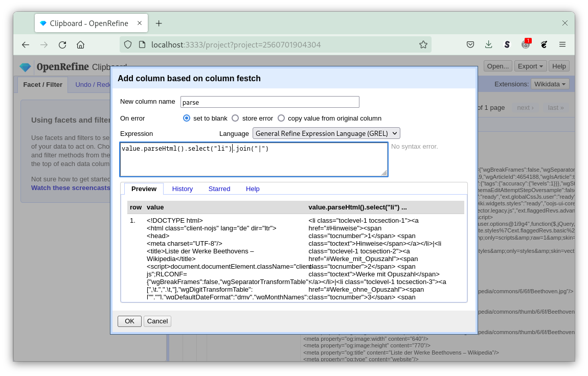
extract all links and separated them
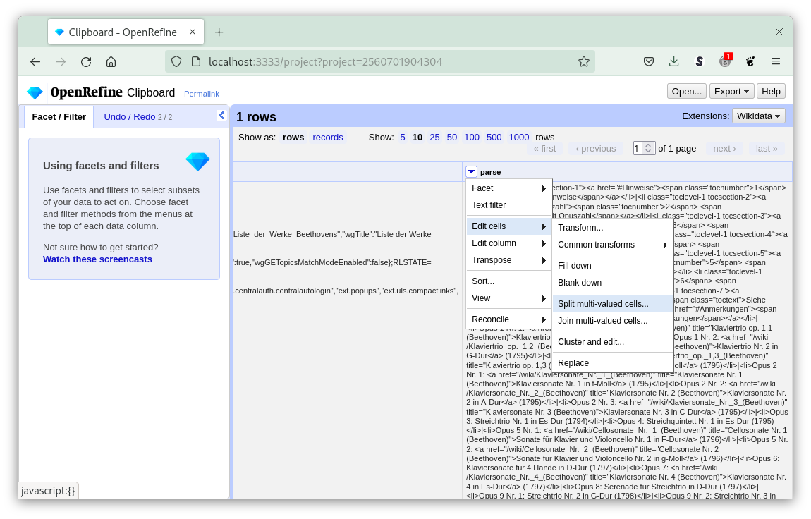
split cells
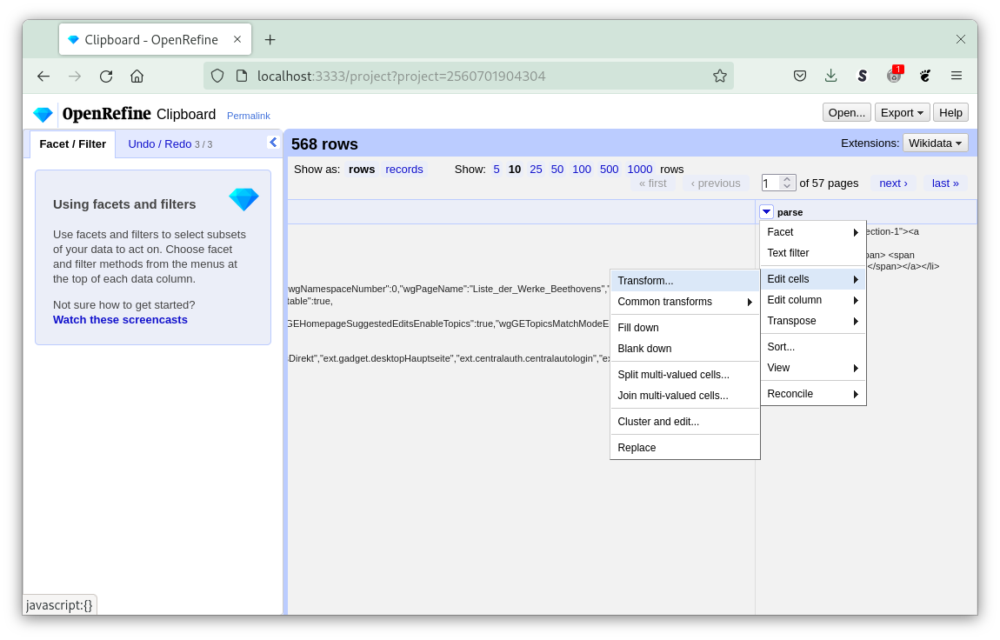
add transformation
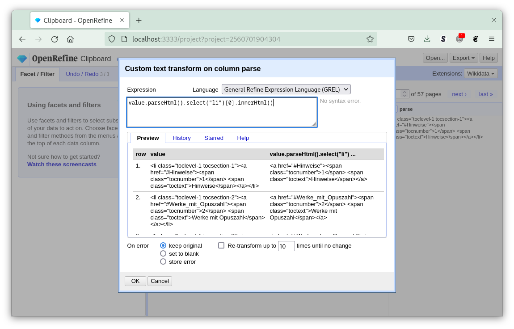
extract links
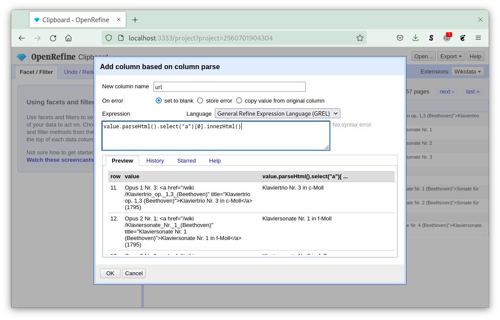
extract name
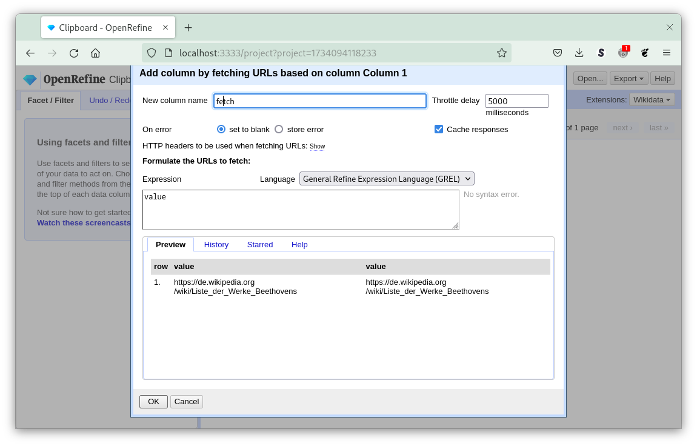
fetch data
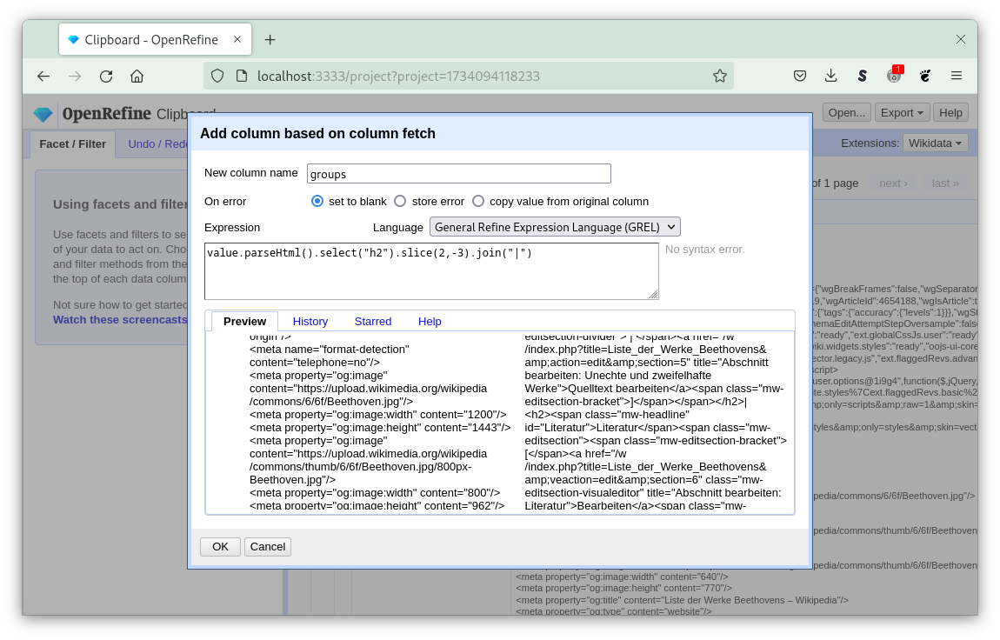
extract groups

