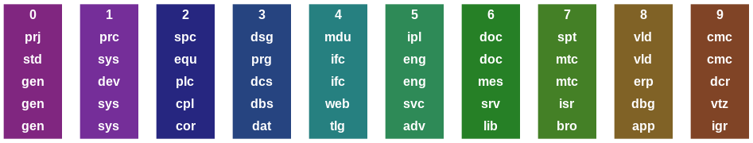
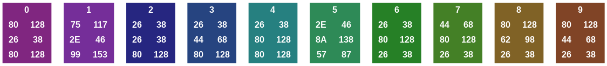

# wro-h-base

WRO's how-to base collection  
covers topics/systems from device to ERP

|no | abr | abr | abr | abr | abr |color      |color              |
|---|---  |---  |---  |---  |---  |---        |---                |
|0  | std | gen | prj | gen | gen |`#802680`  |`RGB(128,38,128)`  |
|1  | sys | sys | prc | sys | dev |`#752E99`  |`RGB(117,46,153)`  |
|2  | equ | cor | spc | cpl | plc |`#262680`  |`RGB(38,68,128)`   |
|3  | prg | dat | dsg | dbs | dcs |`#264480`  |`RGB(38,68,128)`   |
|4  | ifc | tlg | mdu | web | ifc |`#268080`  |`RGB(38,128,128)`  |
|5  | eng | adv | ipl | svc | eng |`#2E8A57`  |`RGB(46,138,87)`   |
|6  | doc | lib | doc | srv | mes |`#268026`  |`RGB(38,128,38)`   |
|7  | mtc | bro | spt | isr | mtc |`#448026`  |`RGB(68,128,38)`   |
|8  | vld | apl | vld | dbg | erp |`#806226`  |`RGB(128,98,38)`   |
|9  | cmc | igr | cmc | vtz | dcr |`#804426`  |`RGB(128,68,38)`   |

## engineering

| topic             | name          | comment       |color      |color              |
| -----             | ----          | -------       |---        |---                |
| [0_std][eng_0_std]| standard      |               |`#802680`  |`RGB(128,38,128)`  |
| [1_sys][eng_1_sys]| system        |               |`#752E99`  |`RGB(117,46,153)`  |
| [2_equ][eng_2_equ]| equipment     |               |`#262680`  |`RGB(38,68,128)`   |
| [3_prg][eng_3_prg]| program       |               |`#264480`  |`RGB(38,68,128)`   |
| [4_itc][eng_4_ifc]| interface     |               |`#268080`  |`RGB(38,128,128)`  |
| [5_eng][eng_5_eng]| engineering   |               |`#2E8A57`  |`RGB(46,138,87)`   |
| [6_doc][eng_6_doc]| documentation |               |`#268026`  |`RGB(38,128,38)`   |
| [7_mtc][eng_7_mtc]| maintenance   |               |`#448026`  |`RGB(68,128,38)`   |
| [8_vld][eng_8_vld]| validation    |               |`#806226`  |`RGB(128,98,38)`   |
| [9_cmc][eng_9_cmc]| commercial    |               |`#804426`  |`RGB(128,68,38)`   |

[eng_0_std]: ./tpl/eng/0_std/README.md
[eng_1_sys]: ./tpl/eng/1_sys/README.md
[eng_2_equ]: ./tpl/eng/2_equ/README.md
[eng_3_prg]: ./tpl/eng/3_prg/README.md
[eng_4_ifc]: ./tpl/eng/4_ifc/README.md
[eng_5_eng]: ./tpl/eng/5_eng/README.md
[eng_6_doc]: ./tpl/eng/6_doc/README.md
[eng_7_mtc]: ./tpl/eng/7_mtc/README.md
[eng_8_vld]: ./tpl/eng/8_vld/README.md
[eng_9_cmc]: ./tpl/eng/9_cmc/README.md

## coding

| topic             | name          | comment       |color      |color              |
| -----             | ----          | -------       |---        |---                |
| [0_gen][cod_0_gen]| general       |               |`#802680`  |`RGB(128,38,128)`  |
| [1_sys][cod_1_sys]| system        |               |`#752E99`  |`RGB(117,46,153)`  |
| [2_cor][cod_2_cor]| core          |               |`#262680`  |`RGB(38,68,128)`   |
| [3_dat][cod_3_dat]| data          |               |`#264480`  |`RGB(38,68,128)`   |
| [4_tlg][cod_4_tlg]| telegram      |               |`#268080`  |`RGB(38,128,128)`  |
| [5_adv][cod_5_adv]| advanced      |               |`#2E8A57`  |`RGB(46,138,87)`   |
| [6_lib][cod_6_lib]| library       |               |`#268026`  |`RGB(38,128,38)`   |
| [7_bro][cod_7_bro]| broker        |               |`#448026`  |`RGB(68,128,38)`   |
| [8_app][cod_8_app]| application   |               |`#806226`  |`RGB(128,98,38)`   |
| [9_igr][cod_9_igr]| integration   |               |`#804426`  |`RGB(128,68,38)`   |

[cod_0_std]: ./tpl/cod/0_std/README.md
[cod_1_sys]: ./tpl/cod/1_sys/README.md
[cod_2_cor]: ./tpl/cod/2_cor/README.md
[cod_3_dat]: ./tpl/cod/3_dat/README.md
[cod_4_tlg]: ./tpl/cod/4_tlg/README.md
[cod_5_adv]: ./tpl/cod/5_adv/README.md
[cod_6_lib]: ./tpl/cod/6_lib/README.md
[cod_7_bro]: ./tpl/cod/7_bro/README.md
[cod_8_app]: ./tpl/cod/8_app/README.md
[cod_9_igr]: ./tpl/cod/9_igr/README.md

## project

| topic             | name          | comment       |color      |color              |
| -----             | ----          | -------       |---        |---                |
| [0_prj][prj_0_prj]| project       |               |`#802680`  |`RGB(128,38,128)`  |
| [1_prc][prj_1_prc]| process       |               |`#752E99`  |`RGB(117,46,153)`  |
| [2_spc][prj_2_spc]| specification |               |`#262680`  |`RGB(38,68,128)`   |
| [3_dsg][prj_3_dsg]| design        |               |`#264480`  |`RGB(38,68,128)`   |
| [4_mdu][prj_4_mdu]| module        |               |`#268080`  |`RGB(38,128,128)`  |
| [5_ipl][prj_5_ipl]| implementation|               |`#2E8A57`  |`RGB(46,138,87)`   |
| [6_doc][prj_6_doc]| documentation |               |`#268026`  |`RGB(38,128,38)`   |
| [7_spt][prj_7_spt]| support       |               |`#448026`  |`RGB(68,128,38)`   |
| [8_vld][prj_8_vld]| validation    |               |`#806226`  |`RGB(128,98,38)`   |
| [9_cmc][prj_9_cmc]| commercial    |               |`#804426`  |`RGB(128,68,38)`   |

[prj_0_prj]: ./tpl/prj/0_prj/README.md
[prj_1_prc]: ./tpl/prj/1_prc/README.md
[prj_2_spc]: ./tpl/prj/2_spc/README.md
[prj_3_dsg]: ./tpl/prj/3_dsg/README.md
[prj_4_mdu]: ./tpl/prj/4_mdu/README.md
[prj_5_ipl]: ./tpl/prj/5_ipl/README.md
[prj_6_doc]: ./tpl/prj/6_doc/README.md
[prj_7_spt]: ./tpl/prj/7_spt/README.md
[prj_8_vld]: ./tpl/prj/8_vld/README.md
[prj_9_cmc]: ./tpl/prj/9_cmc/README.md

## level 2

### level 2_aut{#lv2_aut}

automation

| no | abr | name                       | comment       |
|--- | ----| -------                    | -------       |
|0   |gen   |general
|1   |dev   |device
|2   |plc   |programmable  logic  controller
|3   |dcs   |distributed  control  system
|4   |ifc   |interface
|5   |eng   |engineering
|6   |mes   |manufacturing  execution  system
|7   |mtc   |maintenance
|8   |erp   |enterprise   resource  planning
|9   |dcr   |data center

### level 2_isr{#lv2_isr}

implementation software reporting

| no | abr  | name                       | comment       |
|--- | ---- | -------                    | -------       |
|0   |gen   |general
|1   |sys   |system
|2   |cpl   |compiler
|3   |dbs   |database system
|4   |net   |network
|5   |svc   |service
|6   |srv   |server
|7   |bro   |broker
|8   |dbg   |debug
|9   |vtz   |virtualization

## level 3

### level 3_cmn{#lv3_cmn}

communication

| no | abr | name                       | comment       |
|--- | ----| -------                    | -------       |
|0   | gen | general                    |               |
|1   | mtg | meeting minutes            |               |
|2   | iqy | inquiry                    |               |
|3   | csp | correspondence             |               |
|4   | org | organization plan          |               |
|5   | off | offer                      |               |
|6   | puc | purchase memo              |               |
|7   | tsm | transmittal shipping       |               |
|8   | org | organization plan          |               |
|9   | rpr | reports times notes travel |               |

### level 3_vld{#lv3_vld}

validation

| no | abr | name                       | comment       |
|--- | ----| -------                    | -------       |
|0   | gen |general                     |               |
|1   | IHT |in-house test               |               |
|2   | CMS |commissioning               |               |
|3   | FAT |factory acceptance test     |               |
|4   | SAT |site acceptance test        |               |
|5   |     |                            |               |
|6   |     |                            |               |
|7   |     |                            |               |
|8   | adt |audit                       |               |
|9   | rpr |report                      |               |

### level 3_s88{#lv3_s88}

hierarchy

| no | abr | name                               | comment       |
|--- | ----| -------                            | -------       |
|0   |     |                                    |               |
|1   |CM   |control module                      |               |
|2   |EM   |equipment module                    |               |
|3   |UT   |unit                                |               |
|4   |PC   |process cell                        |               |
|5   |AR   |area                                |               |
|6   |ST   |site                                |               |
|7   |     |                                    |               |
|8   |ET   |enterprise                          |               |
|9   |     |                                    |               |

| no | abr | name                               | comment       |
|--- | ----| -------                            | -------       |
|0   |      |                                   |               |
|1   |CME   |CM entity                          |               |
|2   |EME   |EM entity                          |               |
|3   |UTE   |UT entity                          |               |
|4   |PCE   |PC entity                          |               |
|5   |      |                                   |               |
|6   |      |                                   |               |
|7   |      |                                   |               |
|8   |      |                                   |               |
|9   |      |                                   |               |

| no | abr | name                               | comment       |
|--- | ----| -------                            | -------       |
|0   |      |                                   |               |
|1  |PH     |phase                              |               |
|2  |OP     |operation                          |               |
|3  |UPCD   |unit procedure                     |               |
|4  |PCD    |procedure                          |               |
|5  |       |                                   |               |
|6  |       |                                   |               |
|7  |       |                                   |               |
|8  |       |                                   |               |
|9  |       |                                   |               |

### level 3{#lv3_prg}

| no | abr | name                               | comment       |
|--- | ----| -------                            | -------       |
|0   |gen   |general                            |               |
|1   |sys   |sys lang shell                     |               |
|2   |cor   |c cpp SCL ST core lang             |               |
|3   |dat   |data lang sql xml xsl              |               |
|4   |tlg   |telegram data exchange stored proc handling|       |
|5   |adv   |advanced lang python java swig     |               |
|6   |lib   |library                            |               |
|7   |bro   |broker application srv SOA         |               |
|8   |app   |application                        |               |
|9   |igr   |integration                        |               |
